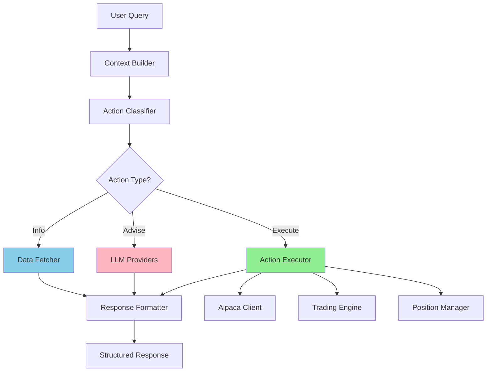

# Design Document

## Overview

This design transforms the DayTraderAI copilot from a passive advisory system into an action-oriented assistant capable of executing trading operations. The current implementation routes all queries to LLM providers (OpenRouter/Perplexity) which generate text-based advice. The new design introduces an action execution layer that intercepts actionable commands and executes them directly against trading APIs before (or instead of) consulting LLMs.

The core architectural change is the introduction of an **Action Classifier** and **Action Executor** that sit between the query router and the LLM providers. This allows the system to:

1. Detect when a query requires execution (e.g., "close TSLA") vs advice (e.g., "should I close TSLA?")
2. Execute the operation directly using existing clients (AlpacaClient, TradingEngine)
3. Format structured responses with execution details
4. Fall back to LLM consultation for complex or ambiguous queries

## Architecture

### Current Flow
```
User Query → Context Builder → Query Router → LLM Providers → Text Response
```

### New Flow
```
User Query → Context Builder → Action Classifier → [Action Executor OR LLM Providers] → Structured Response
```

### Component Diagram



## Components and Interfaces

### 1. Action Classifier

**Purpose**: Analyze user queries to determine if they require execution, advice, or information retrieval.

**Location**: `backend/copilot/action_classifier.py`

**Interface**:
```python
@dataclass
class ActionIntent:
    """Represents the classified intent of a user query."""
    intent_type: str  # "execute", "advise", "info"
    action: Optional[str]  # "close_position", "check_market", "get_position", etc.
    confidence: float  # 0.0 to 1.0
    parameters: Dict[str, Any]  # Extracted parameters (symbol, price, etc.)
    requires_confirmation: bool  # True for high-value operations
    
class ActionClassifier:
    """Classifies user queries into actionable intents."""
    
    def classify(self, query: str, context: Dict[str, Any]) -> ActionIntent:
        """
        Analyze query and return classified intent.
        
        Args:
            query: User's natural language query
            context: Trading context from ContextBuilder
            
        Returns:
            ActionIntent with classification and extracted parameters
        """
```

**Classification Logic**:

- **Execute Intent**: Imperative verbs + specific targets
  - Keywords: "close", "cancel", "set", "move", "exit", "sell all"
  - Requires: Symbol or "all" quantifier
  - Examples: "close TSLA", "cancel all orders", "set stop loss on AAPL to 270"

- **Info Intent**: Question words + status/data requests
  - Keywords: "is", "what", "show", "how", "status", "check"
  - Examples: "is market open?", "show TSLA position", "what's my P/L?"

- **Advise Intent**: Should/would questions, analysis requests
  - Keywords: "should", "would", "recommend", "think", "analysis"
  - Examples: "should I close TSLA?", "what do you think about AAPL?"

**Parameter Extraction**:
- Symbol extraction using regex + watchlist validation
- Price extraction for stop-loss/take-profit modifications
- Quantity extraction for partial closes
- "all" quantifier detection for bulk operations

### 2. Action Executor

**Purpose**: Execute classified actions against trading APIs and return structured results.

**Location**: `backend/copilot/action_executor.py`

**Interface**:
```python
@dataclass
class ExecutionResult:
    """Result of an executed action."""
    success: bool
    action: str
    details: Dict[str, Any]  # Action-specific details
    message: str  # Human-readable confirmation
    error: Optional[str] = None
    
class ActionExecutor:
    """Executes trading actions based on classified intents."""
    
    def __init__(
        self,
        alpaca_client: AlpacaClient,
        trading_engine: TradingEngine,
        position_manager: PositionManager,
        risk_manager: RiskManager,
    ):
        self._alpaca = alpaca_client
        self._engine = trading_engine
        self._positions = position_manager
        self._risk = risk_manager
        
    async def execute(self, intent: ActionIntent, context: Dict[str, Any]) -> ExecutionResult:
        """
        Execute the action specified in the intent.
        
        Args:
            intent: Classified action intent with parameters
            context: Current trading context
            
        Returns:
            ExecutionResult with success status and details
        """
```

**Supported Actions**:

1. **check_market_status**
   - Calls `alpaca_client.get_clock()`
   - Returns: is_open, next_open, next_close, is_extended_hours

2. **close_position**
   - Validates position exists
   - Checks circuit breaker status
   - Calls `trading_engine.close_position(symbol)`
   - Returns: order_id, filled_qty, fill_price, realized_pl

3. **close_all_positions**
   - Iterates through open positions
   - Closes each with confirmation
   - Returns: list of closed positions with details

4. **cancel_order**
   - Validates order exists
   - Calls `alpaca_client.cancel_order(order_id)`
   - Returns: cancelled order details

5. **cancel_all_orders**
   - Calls `alpaca_client.cancel_all_orders()`
   - Returns: count of cancelled orders

6. **modify_stop_loss**
   - Validates position exists
   - Validates new stop level (below price for long, above for short)
   - Validates minimum distance (ATR-based or percentage)
   - Updates bracket order
   - Returns: old_stop, new_stop, position details

7. **modify_take_profit**
   - Similar to modify_stop_loss
   - Validates take profit level (above price for long, below for short)

8. **get_position_details**
   - Fetches position from trading_state
   - Enriches with current market data
   - Fetches recent news for symbol
   - Returns: comprehensive position snapshot

9. **get_account_summary**
   - Aggregates account metrics
   - Returns: equity, cash, buying_power, daily_pl, positions summary

### 3. Response Formatter

**Purpose**: Format execution results and LLM responses into consistent structured output.

**Location**: `backend/copilot/response_formatter.py`

**Interface**:
```python
@dataclass
class CopilotResponse:
    """Standardized copilot response format."""
    content: str  # Main response text
    response_type: str  # "execution", "advice", "info", "error"
    details: Dict[str, Any]  # Structured data for UI rendering
    confidence: float
    citations: List[Dict[str, Any]]  # For news/research responses
    metadata: Dict[str, Any]  # Route info, timing, etc.
    
class ResponseFormatter:
    """Formats execution results and LLM responses."""
    
    def format_execution(self, result: ExecutionResult) -> CopilotResponse:
        """Format an execution result into a copilot response."""
        
    def format_llm_response(
        self, 
        llm_content: str, 
        route: QueryRoute,
        citations: List[Dict[str, Any]]
    ) -> CopilotResponse:
        """Format an LLM-generated response."""
        
    def format_info_response(self, data: Dict[str, Any], query: str) -> CopilotResponse:
        """Format an information retrieval response."""
```

**Response Templates**:

- **Execution Success**: 
  ```
  ✅ {Action} completed successfully
  
  Details:
  - Symbol: {symbol}
  - Quantity: {qty}
  - Price: ${price}
  - Order ID: {order_id}
  - Timestamp: {timestamp}
  
  {Additional context based on action type}
  ```

- **Execution Failure**:
  ```
  ❌ Failed to {action}
  
  Error: {error_message}
  
  Suggestion: {recovery_suggestion}
  ```

- **Info Response**:
  ```
  📊 {Query subject}
  
  {Structured data presentation}
  
  {Contextual insights}
  ```

### 4. Modified Chat Endpoint

**Location**: `backend/main.py` (existing file, modified)

**Changes**:
```python
@app.post("/chat")
async def chat(request: ChatRequestPayload):
    """Chat with the intelligent copilot assistant."""
    
    # 1. Build context (existing)
    context_result = await copilot_context_builder.build_context(request.message)
    
    # 2. NEW: Classify action intent
    intent = action_classifier.classify(request.message, context_result.context)
    
    # 3. Route based on intent type
    if intent.intent_type == "execute":
        # Execute action directly
        if intent.requires_confirmation and not request.confirmed:
            # Return confirmation request
            return {
                "content": f"Confirm: {intent.action} for {intent.parameters}?",
                "requires_confirmation": True,
                "intent": intent,
            }
        
        result = await action_executor.execute(intent, context_result.context)
        response = response_formatter.format_execution(result)
        
    elif intent.intent_type == "info":
        # Fetch and format data
        data = await data_fetcher.fetch(intent.action, intent.parameters)
        response = response_formatter.format_info_response(data, request.message)
        
    else:  # "advise"
        # Existing LLM routing logic
        route = copilot_router.route(request.message, context_result.context, ...)
        llm_content = await _query_llm_providers(route, context_result, request)
        response = response_formatter.format_llm_response(llm_content, route, citations)
    
    return response
```

## Data Models

### ActionIntent
```python
@dataclass
class ActionIntent:
    intent_type: str  # "execute", "advise", "info"
    action: Optional[str]  # Specific action identifier
    confidence: float  # Classification confidence
    parameters: Dict[str, Any]  # Extracted parameters
    requires_confirmation: bool  # High-value operation flag
    ambiguities: List[str]  # Unclear aspects requiring clarification
```

### ExecutionResult
```python
@dataclass
class ExecutionResult:
    success: bool
    action: str
    details: Dict[str, Any]
    message: str
    error: Optional[str] = None
    before_state: Optional[Dict[str, Any]] = None
    after_state: Optional[Dict[str, Any]] = None
```

### CopilotResponse
```python
@dataclass
class CopilotResponse:
    content: str  # Markdown-formatted response
    response_type: str  # "execution", "advice", "info", "error"
    details: Dict[str, Any]  # Structured data for UI
    confidence: float
    citations: List[Dict[str, Any]]
    metadata: Dict[str, Any]  # Timing, route, model info
```

## Error Handling

### Classification Errors
- **Low Confidence**: If confidence < 0.6, route to LLM with note about uncertainty
- **Ambiguous Parameters**: Return clarification request with options
- **Unknown Action**: Fall back to advice mode with LLM

### Execution Errors
- **API Failures**: Catch exceptions, return structured error with recovery suggestions
- **Validation Failures**: Return clear explanation of constraint violation
- **Circuit Breaker Active**: Explain why action was blocked, show current status
- **Position Not Found**: List available positions, ask for clarification

### Risk Violations
- **Exceeds Position Limit**: Show current utilization, suggest alternatives
- **Invalid Stop Level**: Explain minimum distance requirement, suggest valid range
- **Insufficient Buying Power**: Show available capital, suggest position sizing

## Testing Strategy

### Unit Tests

1. **ActionClassifier Tests** (`test_action_classifier.py`)
   - Test each intent type classification
   - Test parameter extraction for various query formats
   - Test confidence scoring
   - Test ambiguity detection

2. **ActionExecutor Tests** (`test_action_executor.py`)
   - Mock Alpaca/Trading clients
   - Test each action type execution
   - Test error handling for API failures
   - Test risk validation logic

3. **ResponseFormatter Tests** (`test_response_formatter.py`)
   - Test formatting for each response type
   - Test markdown generation
   - Test structured data extraction

### Integration Tests

1. **End-to-End Action Flow** (`test_copilot_actions_e2e.py`)
   - Test complete flow from query to execution
   - Test confirmation flow for high-value operations
   - Test fallback to LLM for ambiguous queries
   - Test error recovery paths

2. **Real API Tests** (`test_copilot_actions_real.py`)
   - Test market status check with real Alpaca API
   - Test position queries with paper trading account
   - Test order cancellation (paper trading only)

### Manual Testing Scenarios

1. Market status queries: "is market open?", "when does market close?"
2. Position queries: "show TSLA", "how is my AAPL position?"
3. Close commands: "close TSLA", "exit all positions"
4. Stop-loss modifications: "set stop loss on GOOGL to 280"
5. Ambiguous commands: "close position" (which one?)
6. Invalid commands: "set stop loss on TSLA to 500" (above current price for long)
7. Advice queries: "should I close TSLA?" (should route to LLM)

## Performance Considerations

### Latency Targets
- **Action Execution**: < 1 second for simple operations (market status, position queries)
- **Order Execution**: < 2 seconds for close/cancel operations
- **LLM Fallback**: < 5 seconds for advice queries (existing behavior)

### Caching Strategy
- Cache market status for 30 seconds (market hours don't change frequently)
- Cache position data for 5 seconds (updated by streaming)
- No caching for execution operations (must be real-time)

### Optimization
- Parallel execution for bulk operations (close all, cancel all)
- Async/await for all API calls
- Reuse existing context builder cache

## Security Considerations

### Authorization
- All actions require valid API keys (existing check)
- No new authentication required (uses existing session)

### Validation
- Validate all extracted parameters before execution
- Sanitize symbol inputs against watchlist
- Validate price levels against current market data
- Check circuit breaker before any trade execution

### Audit Trail
- Log all action classifications with confidence scores
- Log all execution attempts with results
- Include user query, intent, and outcome in logs
- Store execution history in Supabase for review

### Rate Limiting
- Respect Alpaca API rate limits (existing)
- Add per-user rate limiting for bulk operations (max 10 closes per minute)
- Throttle confirmation requests (max 5 pending confirmations)

## Migration Strategy

### Phase 1: Add New Components (No Breaking Changes)
- Implement ActionClassifier, ActionExecutor, ResponseFormatter
- Add new components to dependency injection
- Keep existing chat endpoint logic intact

### Phase 2: Integrate Action Layer
- Modify chat endpoint to use action classifier
- Route execute/info intents to new components
- Keep advise intents using existing LLM flow
- Add feature flag to enable/disable action execution

### Phase 3: Testing and Refinement
- Test with paper trading account
- Gather user feedback on classification accuracy
- Tune confidence thresholds
- Refine parameter extraction patterns

### Phase 4: Full Deployment
- Enable action execution by default
- Monitor error rates and latency
- Iterate on response formatting based on usage

## Configuration

Add to `backend/copilot/config.py`:

```python
@dataclass
class CopilotConfig:
    # Existing fields...
    
    # Action execution settings
    action_execution_enabled: bool = True
    action_confidence_threshold: float = 0.7
    require_confirmation_above_value: float = 1000.0  # USD
    max_bulk_operations: int = 10
    action_timeout_seconds: float = 5.0
    
    # Classification settings
    classification_cache_ttl: int = 0  # No caching for classifications
    parameter_extraction_strict: bool = True
```

## Dependencies

No new external dependencies required. Uses existing:
- `AlpacaClient` for market data and order execution
- `TradingEngine` for position management
- `RiskManager` for validation
- `SupabaseClient` for audit logging
- `trading_state` for current state access

## Future Enhancements

1. **Multi-step Actions**: "Close TSLA and open NVDA position"
2. **Scheduled Actions**: "Close all positions at 3:50 PM"
3. **Conditional Actions**: "Close TSLA if it drops below 450"
4. **Voice Commands**: Integrate with speech-to-text for voice trading
5. **Action Suggestions**: Proactively suggest actions based on market conditions
6. **Undo/Rollback**: Allow reverting recent actions within a time window
