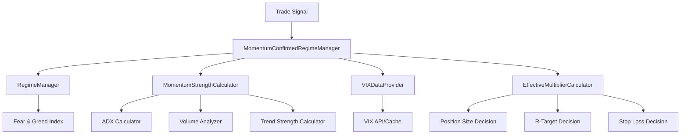

# Design Document: Momentum-Confirmed Regime System

## Overview

This feature upgrades the existing `RegimeManager` to use momentum confirmation before making position sizing decisions. Instead of simple regime-based multipliers, the system combines Fear & Greed sentiment with real-time momentum indicators (ADX, volume ratio, trend strength) to make smarter sizing decisions that match professional intraday trading practices.

The key insight: Extreme greed with strong momentum = ride the wave (1.2x). Extreme greed with weak momentum = protect against reversal (0.7x).

## Architecture



## Components and Interfaces

### 1. MomentumStrengthCalculator

Calculates composite momentum strength from existing indicators.

```python
class MomentumStrengthCalculator:
    """Calculates composite momentum strength score (0-1)"""
    
    def __init__(self):
        self.adx_calculator = ADXCalculator(period=14)
        self.volume_analyzer = VolumeAnalyzer(lookback_period=20)
        self.trend_calculator = TrendStrengthCalculator()
        
        # Thresholds for "confirmed" status
        self.adx_threshold = 25.0
        self.volume_threshold = 1.5
        self.trend_threshold = 0.7
    
    def calculate_strength(
        self, 
        high: List[float], 
        low: List[float], 
        close: List[float], 
        volume: List[float]
    ) -> MomentumStrengthResult:
        """
        Calculate composite momentum strength.
        
        Returns:
            MomentumStrengthResult with score (0-1) and component details
        """
        pass
    
    def validate_inputs(self, adx: float, volume_ratio: float, trend: float) -> Tuple[float, float, float]:
        """Sanitize invalid indicator values to defaults"""
        pass
```

### 2. VIXDataProvider

Provides VIX data with caching and fallback.

```python
class VIXDataProvider:
    """Provides VIX data with caching"""
    
    def __init__(self, cache_ttl_minutes: int = 15):
        self.cache_ttl = timedelta(minutes=cache_ttl_minutes)
        self._cached_vix: Optional[float] = None
        self._last_update: datetime = datetime.min
    
    def get_vix(self) -> float:
        """Get current VIX value, with fallback to default (20)"""
        pass
    
    def get_vix_cap(self, vix: float) -> float:
        """Get position size cap based on VIX level"""
        pass
```

### 3. MomentumConfirmedRegimeManager

Main component that combines all factors.

```python
class MomentumConfirmedRegimeManager:
    """
    Combines regime, momentum, and VIX for position sizing decisions.
    Extends existing RegimeManager with momentum confirmation.
    """
    
    def __init__(self, regime_manager: RegimeManager):
        self.regime_manager = regime_manager
        self.momentum_calculator = MomentumStrengthCalculator()
        self.vix_provider = VIXDataProvider()
    
    def get_effective_multiplier(
        self,
        momentum_strength: float,
        confidence: float
    ) -> EffectiveMultiplierResult:
        """
        Calculate effective position multiplier combining all factors.
        
        Returns:
            EffectiveMultiplierResult with multiplier and component breakdown
        """
        pass
    
    def get_momentum_adjusted_params(
        self,
        momentum_strength: float
    ) -> Dict[str, Any]:
        """
        Get regime params adjusted for momentum strength.
        Includes R-targets and stop loss settings.
        """
        pass
```

## Data Models

```python
@dataclass
class MomentumStrengthResult:
    """Result of momentum strength calculation"""
    score: float  # 0.0 to 1.0
    adx: float
    adx_confirmed: bool
    volume_ratio: float
    volume_confirmed: bool
    trend_strength: float
    trend_confirmed: bool
    timestamp: datetime
    data_fresh: bool = True

@dataclass
class EffectiveMultiplierResult:
    """Result of effective multiplier calculation"""
    multiplier: float  # 0.5 to 1.5
    regime_multiplier: float
    momentum_multiplier: float
    vix_cap: float
    regime: MarketRegime
    momentum_strength: float
    vix_level: float
    reasoning: str

@dataclass
class MomentumAdjustedParams:
    """Trading parameters adjusted for momentum"""
    profit_target_r: float
    trailing_stop_r: float
    position_multiplier: float
    regime: MarketRegime
    momentum_strength: float
```

## Correctness Properties

*A property is a characteristic or behavior that should hold true across all valid executions of a system-essentially, a formal statement about what the system should do. Properties serve as the bridge between human-readable specifications and machine-verifiable correctness guarantees.*

### Property 1: Momentum strength is always bounded
*For any* combination of ADX, volume ratio, and trend strength values, the calculated momentum strength score SHALL always be between 0.0 and 1.0 inclusive.
**Validates: Requirements 1.1**

### Property 2: Extreme greed position multiplier follows tiered rules
*For any* extreme greed regime and momentum strength value, the position multiplier SHALL be:
- 1.2x when momentum > 0.8
- 0.9x when momentum is 0.5-0.8
- 0.7x when momentum < 0.5
**Validates: Requirements 2.1, 2.2, 2.3**

### Property 3: Extreme fear position multiplier follows tiered rules
*For any* extreme fear regime and momentum strength value, the position multiplier SHALL be:
- 1.0x when momentum > 0.7
- 0.8x when momentum <= 0.7
**Validates: Requirements 3.1, 3.2**

### Property 4: VIX cap follows tiered rules
*For any* VIX level, the position size cap SHALL be:
- 1.2x when VIX < 15
- 1.0x when VIX is 15-25
- 0.9x when VIX is 25-35
- 0.7x when VIX > 35
**Validates: Requirements 4.1, 4.2, 4.3, 4.4**

### Property 5: Combined multiplier is always bounded
*For any* combination of regime multiplier, momentum multiplier, and VIX cap, the final combined multiplier SHALL always be between 0.5x and 1.5x inclusive.
**Validates: Requirements 5.2, 5.3**

### Property 6: Combined multiplier is product of components
*For any* regime multiplier, momentum multiplier, and VIX cap, the combined multiplier (before bounding) SHALL equal regime_mult × momentum_mult × min(1.0, vix_cap).
**Validates: Requirements 5.1**

### Property 7: R-target adjustment follows momentum rules
*For any* regime and momentum strength:
- Strong momentum (>0.8) increases base R-target by 0.5R
- Weak momentum (<0.5) decreases base R-target by 0.5R
- Extreme fear caps R-target at 2.0R regardless of momentum
**Validates: Requirements 6.1, 6.2, 6.5**

### Property 8: Invalid indicator values are sanitized
*For any* ADX value outside [0, 100], volume ratio outside [0, 10], or trend strength outside [0, 1], the system SHALL sanitize to default values (ADX=25, volume=1.0, trend=0.5).
**Validates: Requirements 8.2, 8.3, 8.4**

### Property 9: Extreme fear always uses wide trailing stop
*For any* extreme fear regime, regardless of momentum strength, the trailing stop SHALL be 1.0R.
**Validates: Requirements 3.3**

### Property 10: Extreme greed with strong momentum uses tight trailing stop
*For any* extreme greed regime with momentum > 0.8, the trailing stop SHALL be 0.5R.
**Validates: Requirements 2.4**

## Error Handling

1. **Missing Momentum Data**: Fall back to simple regime-based sizing (existing behavior)
2. **Invalid Indicator Values**: Sanitize to defaults and log warning
3. **Stale Data (>1 hour)**: Use conservative defaults and log warning
4. **VIX Unavailable**: Default to VIX=20 (normal volatility)
5. **API Errors**: Retry up to 3 times, then use cached values

## Testing Strategy

### Property-Based Testing

The system will use **Hypothesis** (Python property-based testing library) to verify correctness properties.

Each property-based test MUST:
1. Be annotated with the property number and requirements it validates
2. Run a minimum of 100 iterations
3. Use the format: `**Feature: momentum-confirmed-regime, Property {number}: {property_text}**`

### Unit Tests

Unit tests will cover:
- Component initialization
- Edge cases (boundary values)
- Integration between components
- API response format

### Test Configuration

```python
# pytest.ini or conftest.py
from hypothesis import settings

settings.register_profile("ci", max_examples=100)
settings.register_profile("dev", max_examples=50)
```

