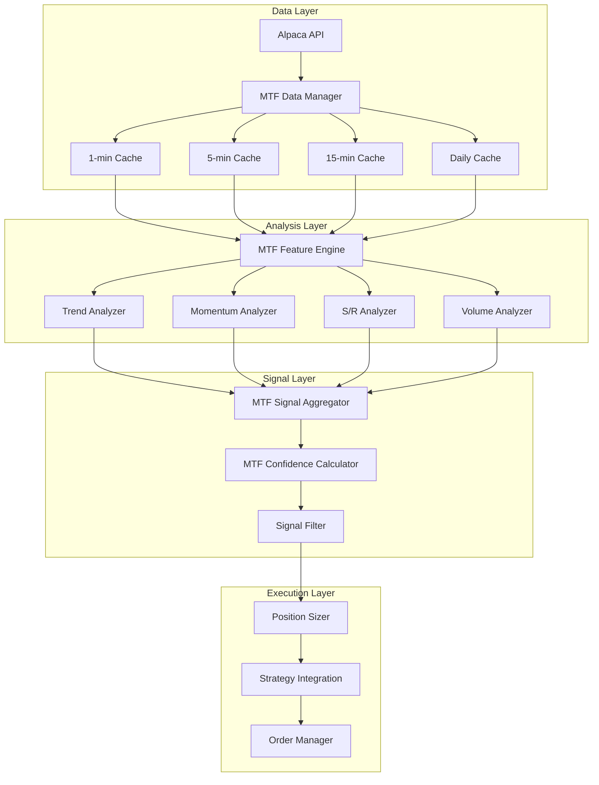

# Design Document: Multi-Timeframe Analysis (MTA) System

## Overview

The Multi-Timeframe Analysis (MTA) system enhances the DayTraderAI trading bot by incorporating signals from multiple timeframes (1-minute, 5-minute, 15-minute, and daily) to improve trade entry decisions. Research shows this approach can improve win rates from 45% to 62%+ and risk-adjusted returns by 23%.

The system follows a top-down analysis approach:
1. **Daily**: Overall market context and key levels
2. **15-minute**: Primary trend direction and major S/R zones
3. **5-minute**: Intermediate momentum confirmation
4. **1-minute**: Precise entry timing (existing system)

## Architecture



## Components and Interfaces

### 1. MTFDataManager

Manages multi-timeframe data fetching and caching.

```python
class MTFDataManager:
    """Manages multi-timeframe market data."""
    
    def __init__(self, alpaca_client: AlpacaClient):
        self.alpaca = alpaca_client
        self.cache = {
            '1min': {},   # symbol -> DataFrame
            '5min': {},
            '15min': {},
            'daily': {}
        }
        self.last_refresh = {
            '1min': None,
            '5min': None,
            '15min': None,
            'daily': None
        }
    
    def fetch_all_timeframes(self, symbol: str) -> Dict[str, pd.DataFrame]:
        """Fetch data for all timeframes for a symbol."""
        pass
    
    def refresh_timeframe(self, timeframe: str, symbols: List[str]) -> None:
        """Refresh data for a specific timeframe."""
        pass
    
    def get_cached_data(self, symbol: str, timeframe: str) -> Optional[pd.DataFrame]:
        """Get cached data for a symbol and timeframe."""
        pass
```

### 2. MTFFeatureEngine

Calculates indicators for each timeframe.

```python
class MTFFeatureEngine:
    """Calculates features for multiple timeframes."""
    
    def calculate_mtf_features(
        self, 
        symbol: str, 
        data: Dict[str, pd.DataFrame]
    ) -> MTFFeatures:
        """Calculate features for all timeframes."""
        pass
    
    def calculate_timeframe_features(
        self, 
        df: pd.DataFrame, 
        timeframe: str
    ) -> TimeframeFeatures:
        """Calculate features for a single timeframe."""
        pass
```

### 3. TrendAnalyzer

Determines trend direction from higher timeframes.

```python
class TrendAnalyzer:
    """Analyzes trend across timeframes."""
    
    def get_trend_bias(self, features: MTFFeatures) -> TrendBias:
        """Determine overall trend bias from 15-min and daily."""
        pass
    
    def check_trend_alignment(
        self, 
        signal: str, 
        trend_bias: TrendBias
    ) -> bool:
        """Check if signal aligns with higher timeframe trend."""
        pass
```

### 4. MomentumAnalyzer

Confirms momentum alignment across timeframes.

```python
class MomentumAnalyzer:
    """Analyzes momentum across timeframes."""
    
    def check_rsi_alignment(
        self, 
        features: MTFFeatures, 
        signal: str
    ) -> Tuple[bool, int]:
        """Check RSI alignment, return (aligned, count)."""
        pass
    
    def check_macd_alignment(
        self, 
        features: MTFFeatures, 
        signal: str
    ) -> bool:
        """Check MACD alignment on 5-min and 15-min."""
        pass
    
    def get_momentum_score(self, features: MTFFeatures, signal: str) -> int:
        """Calculate momentum alignment score."""
        pass
```

### 5. SupportResistanceAnalyzer

Identifies S/R levels from higher timeframes.

```python
class SupportResistanceAnalyzer:
    """Identifies support and resistance levels."""
    
    def find_swing_points(
        self, 
        df: pd.DataFrame, 
        lookback: int = 50
    ) -> Tuple[List[float], List[float]]:
        """Find swing highs and lows."""
        pass
    
    def get_nearest_levels(
        self, 
        price: float, 
        features: MTFFeatures
    ) -> SRLevels:
        """Get nearest support and resistance levels."""
        pass
    
    def is_near_level(
        self, 
        price: float, 
        level: float, 
        threshold_pct: float = 0.3
    ) -> bool:
        """Check if price is near a level."""
        pass
```

### 6. MTFConfidenceCalculator

Calculates weighted confidence score.

```python
class MTFConfidenceCalculator:
    """Calculates multi-timeframe confidence score."""
    
    DEFAULT_WEIGHTS = {
        '15min': 0.40,
        '5min': 0.35,
        '1min': 0.25
    }
    
    def calculate_confidence(
        self, 
        features: MTFFeatures,
        signal: str,
        trend_bias: TrendBias,
        momentum_score: int,
        volume_score: int
    ) -> float:
        """Calculate weighted MTF confidence score."""
        pass
    
    def apply_alignment_bonus(
        self, 
        base_confidence: float, 
        all_aligned: bool
    ) -> float:
        """Apply bonus for full timeframe alignment."""
        pass
```

### 7. MTFSignalFilter

Filters signals based on multi-timeframe analysis.

```python
class MTFSignalFilter:
    """Filters signals using multi-timeframe analysis."""
    
    def evaluate_signal(
        self, 
        symbol: str, 
        signal: str, 
        features_1min: Dict
    ) -> Optional[MTFSignalResult]:
        """Evaluate a 1-min signal against higher timeframes."""
        pass
    
    def should_reject(
        self, 
        mtf_confidence: float, 
        trend_aligned: bool
    ) -> Tuple[bool, str]:
        """Determine if signal should be rejected."""
        pass
```

## Data Models

```python
from dataclasses import dataclass
from typing import Dict, List, Optional
from enum import Enum

class TrendDirection(Enum):
    BULLISH = "bullish"
    BEARISH = "bearish"
    NEUTRAL = "neutral"

@dataclass
class TimeframeFeatures:
    """Features for a single timeframe."""
    timeframe: str
    ema_short: float
    ema_long: float
    ema_50: float  # For 15-min trend
    ema_200: float  # For 15-min trend
    rsi: float
    macd: float
    macd_signal: float
    macd_histogram: float
    adx: float
    volume: float
    volume_avg: float
    volume_ratio: float
    high: float
    low: float
    close: float

@dataclass
class MTFFeatures:
    """Features across all timeframes."""
    symbol: str
    tf_1min: TimeframeFeatures
    tf_5min: TimeframeFeatures
    tf_15min: TimeframeFeatures
    tf_daily: TimeframeFeatures
    timestamp: datetime

@dataclass
class TrendBias:
    """Trend bias from higher timeframes."""
    direction: TrendDirection
    strength: float  # 0-100
    daily_aligned: bool
    ema_diff_pct: float

@dataclass
class SRLevels:
    """Support and resistance levels."""
    nearest_support: float
    nearest_resistance: float
    daily_high: float
    daily_low: float
    daily_close: float
    swing_highs: List[float]
    swing_lows: List[float]

@dataclass
class MTFSignalResult:
    """Result of multi-timeframe signal evaluation."""
    symbol: str
    signal: str  # 'buy' or 'sell'
    mtf_confidence: float
    trend_bias: TrendBias
    trend_aligned: bool
    momentum_aligned: bool
    rsi_alignment_count: int
    macd_aligned: bool
    volume_confirmed: bool
    sr_levels: SRLevels
    position_size_multiplier: float
    rejection_reason: Optional[str]
    
@dataclass
class MTFConfig:
    """Configuration for MTF analysis."""
    enabled: bool = True
    strict_mode: bool = False
    min_confidence: float = 60.0
    weights: Dict[str, float] = None
    
    def __post_init__(self):
        if self.weights is None:
            self.weights = {'15min': 0.40, '5min': 0.35, '1min': 0.25}
```

## Correctness Properties

*A property is a characteristic or behavior that should hold true across all valid executions of a system-essentially, a formal statement about what the system should do. Properties serve as the bridge between human-readable specifications and machine-verifiable correctness guarantees.*

### Property 1: Trend Classification Consistency
*For any* 15-minute price data with EMA(50) and EMA(200) values, the trend classification should be:
- Bullish when EMA(50) > EMA(200) by more than 0.1%
- Bearish when EMA(50) < EMA(200) by more than 0.1%
- Neutral when EMAs are within 0.1% of each other
**Validates: Requirements 2.2, 2.3, 2.4**

### Property 2: Signal-Trend Alignment Rejection
*For any* 1-minute buy signal with a bearish 15-minute trend bias, or any 1-minute sell signal with a bullish 15-minute trend bias, the signal should be rejected.
**Validates: Requirements 2.5, 7.1**

### Property 3: RSI Confirmation Rule
*For any* buy signal, RSI must be above 50 on at least 2 of 3 timeframes (1-min, 5-min, 15-min). For any sell signal, RSI must be below 50 on at least 2 of 3 timeframes.
**Validates: Requirements 3.1, 3.2**

### Property 4: MACD Momentum Confirmation
*For any* signal evaluation, bullish momentum confirmation requires positive MACD histogram on both 5-min and 15-min timeframes. Bearish momentum confirmation requires negative MACD histogram on both.
**Validates: Requirements 3.3, 3.4**

### Property 5: Momentum Alignment Confidence Adjustment
*For any* MTF confidence calculation:
- If all three timeframes show aligned momentum, add 25 points
- If momentum indicators conflict across timeframes, subtract 20 points
**Validates: Requirements 3.5, 3.6**

### Property 6: Support/Resistance Position Sizing
*For any* buy entry within 0.3% of a 15-minute resistance level, or any sell entry within 0.3% of a 15-minute support level, position size should be reduced by 30%.
**Validates: Requirements 4.3, 4.4**

### Property 7: Timeframe Weight Calculation
*For any* MTF confidence calculation with default settings, the weights should sum to 100% with 15-min at 40%, 5-min at 35%, and 1-min at 25%. When 15-min ADX > 25, the 15-min weight should increase to 50%.
**Validates: Requirements 5.1, 5.2**

### Property 8: Confidence-Based Position Sizing
*For any* MTF confidence score:
- Below 60: Signal rejected
- 60-70: Position size = 0.7x normal
- 70-80: Position size = 1.0x normal
- Above 80: Position size = up to 1.5x normal
**Validates: Requirements 5.4, 5.5, 5.6**

### Property 9: Volume Confirmation Logic
*For any* signal evaluation, volume confirmation is added when 5-minute volume exceeds 1.5x the 20-period average. MTF confidence is reduced by 10 points when 15-minute volume is below 0.7x average.
**Validates: Requirements 6.2, 6.3**

### Property 10: ADX-Based Position Sizing
*For any* market condition:
- If more than one timeframe has ADX < 20 (ranging), reduce position size by 40%
- If all timeframes have ADX > 25 (trending), allow full position sizing
**Validates: Requirements 7.3, 7.4**

### Property 11: Configuration Override
*For any* custom configuration with ENABLE_MTF_ANALYSIS=False, the system should bypass all multi-timeframe checks and use single-timeframe logic only.
**Validates: Requirements 9.1**

### Property 12: Custom Weight Application
*For any* custom timeframe weights specified in configuration, those weights should be used instead of defaults in confidence calculation.
**Validates: Requirements 9.2**

## Error Handling

1. **Data Fetch Failures**: Use cached data with warning log
2. **Missing Timeframe Data**: Skip that timeframe's contribution, adjust weights proportionally
3. **Invalid Indicator Values**: Use neutral values (RSI=50, MACD=0)
4. **API Rate Limits**: Implement exponential backoff, use cached data
5. **Calculation Errors**: Log error, fall back to single-timeframe analysis

## Testing Strategy

### Unit Tests
- Test each analyzer component independently
- Test confidence calculation with known inputs
- Test S/R level identification
- Test trend classification edge cases

### Property-Based Tests (using Hypothesis)
- Generate random price data and verify trend classification consistency
- Generate random signals and verify rejection rules
- Generate random confidence scores and verify position sizing
- Generate random volume data and verify confirmation logic

### Integration Tests
- Test full signal flow from data fetch to final decision
- Test configuration changes apply correctly
- Test fallback behavior when data is unavailable

## Performance Considerations

1. **Caching Strategy**:
   - 1-min: Refresh every minute (existing)
   - 5-min: Refresh every 5 minutes
   - 15-min: Refresh every 15 minutes
   - Daily: Refresh once at market open

2. **API Call Optimization**:
   - Batch requests for multiple symbols
   - Use streaming data where available
   - Cache aggressively, invalidate on schedule

3. **Computation Efficiency**:
   - Pre-calculate indicators on data refresh
   - Store computed features, not raw data
   - Use numpy vectorized operations
