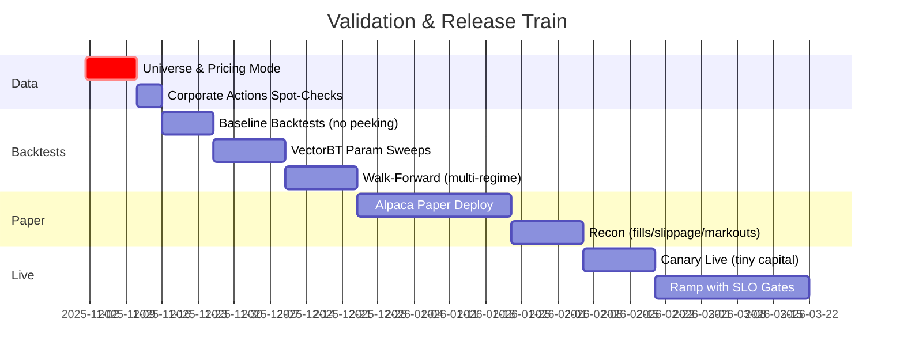

---

# **The Ultimate Expert Day-Trading Bot — Final Implementation Blueprint**

### **MVP-first with Alpaca, Supabase, OpenRouter & Perplexity; production-ready corrections applied**

---

## **Executive Summary**

Sustaining a **~70% win rate** is a stretch goal. Consistent profitability is rare and backtests often overstate live performance; therefore our plan is **risk-first**, **paper-first**, and relentlessly empirical. We move in phases: MVP (rule-based) → backtesting with walk-forward → paper trading → guarded live, with continuous learning loops and strict promotion gates.

**MVP Scope (Now)**

* **Assets:** U.S. equities/ETFs via **Alpaca** (paper trading).
* **Storage/Ops:** **Supabase** (trades, metrics, features, configs).
* **Market Context:** **Perplexity** (news/headlines enrichment).
* **Reasoning UX:** **OpenRouter** (LLM commentary, **advisory-only** with guardrails).
* **Strategy:** One rule-based family (e.g., trend-breakout) + optional supervised “gatekeeper.”

**Stretch (Later)**
Options (Alpaca), futures (alt broker/engine), DRL via FinRL, multi-strategy ensemble, portfolio-level optimization.

---

## **1) Architecture (MVP-first, production-ready)**

```mermaid
graph TB
    %% Data & Integrity
    A[Alpaca Market Data (live + history)] --> B[Ingestion & Validation]
    C[Corporate Actions Feed] --> D[Data Correction Engine]
    D --> B
    E[Perplexity (news)] --> F[Advisory Layer: Source-Verified]
    G[OpenRouter (LLM)] --> F
    B --> H[Feature Engineering]
    H --> I[(Feature Store: cache)]
    H --> J[(Supabase: warehouse)]

    %% Strategy & Decisioning
    I --> K[Backtrader Backtests]
    I --> L[Rule-Based Strategy (v1)]
    L --> M[Supervised Gatekeeper (v1.5)]
    M --> N[Ensemble Combiner (v2+)]

    %% Risk, Compliance & Execution
    N --> O[Risk Manager (limits, ATR stops)]
    O --> P[Compliance (PDT, shorts, margin)]
    P --> Q[Order Manager (brackets/OCO)]
    Q --> R[Execution via Alpaca REST/WS]

    %% Monitoring, Ops & Learning
    R --> S[Execution Monitor]
    S --> T[Paper vs Live Reconciliation]
    T --> U[Perf Analytics & Alerts]
    U --> J
    U --> V[Walk-Forward & Refit Scheduler]
    V --> M

    %% Ops Reliability
    W[Deterministic Idempotency] --> Q
    X[WS Manager (reconnect/backfill)] --> R
    Y[Secrets Mgmt (rotation/least-priv)] --> Q

    classDef dataLayer fill:#e1f5fe,stroke:#90caf9
    classDef strategyLayer fill:#f3e5f5,stroke:#ce93d8
    classDef execLayer fill:#e8f5e9,stroke:#a5d6a7
    classDef monitorLayer fill:#fff3e0,stroke:#ffcc80
    class A,B,C,D,E,F,G,H,I,J dataLayer
    class K,L,M,N strategyLayer
    class O,P,Q,R,W,X,Y execLayer
    class S,T,U,V monitorLayer
```

**Key clarifications**

* **Freqtrade:** use it for **architectural patterns** (strategy interfaces, Hyperopt, FreqAI ideas). Execute equities via **Backtrader backtests** + **thin Alpaca live layer** (REST/WebSocket).
* **LLM & News:** **advisory-only**; never originate orders. Deterministic risk checks must pass regardless.

---

## **2) Universe, Calendars & Data Hygiene**

### 2.1 Corporate-Action Discipline

* Choose **one** path per dataset:

  * **Use adjusted bars from source**, *or*
  * **Use raw bars** and apply your **own** split/dividend adjustments.
    Never both. Record `pricing_mode = {adjusted|raw+local_adjust}` with checksum for reproducibility.

```python
class DataCorrectionEngine:
    def adjust(self, df, symbol, mode, actions):
        if mode == "adjusted": 
            return df  # trust source; validate with spot checks
        if mode == "raw+local_adjust":
            if actions.get("split_ratio", 1.0) != 1.0:
                df = self.apply_split(df, actions["split_ratio"])
            if actions.get("dividend", 0.0) != 0.0:
                df = self.apply_dividend(df, actions["dividend"])
            return df
        raise ValueError("Unknown pricing mode")
```

### 2.2 Universe Construction (survivorship-bias-free)

* **Liquidity:** avg dollar volume top-N; **Price:** ≥ $5; **MktCap:** > $2B (configurable).
* **IPO filter:** exclude first **60 trading days**.
* **Earnings blackout:** **±1 day** of confirmed earnings **from a declared source** (e.g., Polygon/Exchange/Nasdaq calendar).
* **Corporate actions:** don’t blanket-exclude; only restrict around **split week** if testing shows microstructure risk.

### 2.3 Calendars & Halts

* U.S. holidays + **early-closes** → **shorten trading window**, don’t disable the day.
* **Halt feed** (e.g., exchange or SIP event): if unknown → **fail-safe to not initiate new positions** until clarity.

---

## **3) Strategy Layer (MVP → Ensemble)**

### 3.1 MVP Rule-Based Strategy (trend-breakout)

* **Entry:** price > rolling high (e.g., 20-day), **volume z-score > 1.5**, **MA trend filter** (50EMA>200EMA), **time filter** (avoid first/last 15m).
* **Exit:** bracket OCO: initial stop = **k·ATR(14)**, take-profit = **r·ATR(14)**, optional **trailing** after 1.5R.
* **Risk:** ≤ **2% capital at risk** per position; daily **circuit breaker 5%**.
* **Live quirks:** forbid same-bar look-ahead; next-bar execution or realistic L1 fill simulation in backtests.

### 3.2 Supervised “Gatekeeper” (v1.5)

* **Purpose:** filter marginal signals.
* **Features:** ATR ratio, volume z-score, volatility regime, pullback depth, sector strength, market breadth.
* **Leakage controls:**

  * Time-based splits (train < t, validate ≥ t).
  * **Frozen feature schema** per model version.
  * **Shadow (canary) deployment** before promotion.
* **Cadence:** weekly retrain; promotion requires stability across **recent regimes**.

```python
class Gatekeeper:
    def allow(self, signal, ctx):
        feats = self.extract(signal, ctx)                 # frozen schema
        proba = self.model.predict_proba([feats])[0,1]
        return (proba >= self.cfg.threshold), proba
```

### 3.3 DRL R&D (v2+)

* Keep DRL (FinRL) in **R&D tracks** until MVP + gatekeeper are profitable in paper.
* Promotion criteria: ≥ 6 months paper, drawdown limits, regime-robust.

---

## **4) Risk, Compliance & Execution**

```mermaid
flowchart TD
    A[Signal] --> B{Pre-Trade Risk}
    B -->|Fail| Z[Reject & Log]
    B -->|Pass| C[Position Sizing (≤2% risk)]
    C --> D[Stop/TP (ATR-based) + Trailing Rules]
    D --> E{Compliance: PDT, Shorts, Margin}
    E -->|Fail| Z
    E -->|Pass| F[Deterministic Client Order ID]
    F --> G[Submit via Alpaca]
    G --> H[Track Fills & Brackets]
    H --> I[Post-Trade Recon & Mark-outs]
```

**Controls**

* **Trade-level:** risk ≤ 2% cap, min volume/price filters, symbol-tiered max spread.
* **Portfolio-level:** daily breaker 5%; sector exposure caps; correlation gating; concurrent position cap.
* **Shorts mechanics:** easy-to-borrow check; enforce tick/locate rules; reject HTB symbols (or simulate locate).
* **Compliance:** PDT checks; margin utilization ceilings; restart-safe bracket sync.

---

## **5) Execution & OMS (what you actually control)**

### 5.1 Deterministic idempotency (no random UUIDs)

Retries must reuse the same **client_order_id** derived from **order intent** so the broker rejects duplicates safely.

```python
def order_intent_id(sym, side, qty, price_hint, ts_bucket):
    payload = f"{sym}|{side}|{qty}|{price_hint:.4f}|{ts_bucket}"
    return hashlib.sha256(payload.encode()).hexdigest()[:24]  # deterministic

oid = order_intent_id(symbol, side, qty, intended_price, ts_minute_bucket)
if not store.seen(oid):
    resp = alpaca.submit_order(..., client_order_id=oid)
    store.mark_seen(oid, resp)
```

### 5.2 Slippage budgets & mark-outs

* Start symbol-tiered: **LC liquid 5–10 bps**, LC typical 10–20 bps, Mid 20–40 bps, Small 40–80 bps.
* Continuously **measure arrival shortfall** and **1/5/15m mark-outs**; auto-tighten/loosen budgets by symbol.

### 5.3 Pacing algos (TWAP/VWAP-like)

* Implement **client-side slicing** only if empirical evidence shows market/limit is hurting fills. Avoid implying broker SOR you don’t have.

---

## **6) Monitoring, Alerts & Ops**

* **Dashboards:** P/L, PF, win%, DD, slippage, fill%, latency p95, rejects, data gaps, API error rate, margin usage.
* **Actionable alerts:** PF(rolling 200) < 1.1; slippage > 2× median; ≥5 consecutive losses; data gaps; error-rate > 1%.
* **Ops:** idempotent orders; **WS reconnect with last-5-minute backfill**; incident runbooks (API outage, data corruption, strategy degradation); environment separation (paper/live), trade-only keys, rotation every 30 days.

---

## **7) LLM & News Guardrails (OpenRouter / Perplexity)**

* **Advisory-only & veto-only:** LLM/news may veto **but cannot originate** orders.
* **Source discipline:** require verifiable sources; cache & dedupe headlines.
* **Configurable rate limits:** read from env (no hardcoded “100/hr”); log veto stats to monitor selection bias.
* **Fail-safe:** if advisory stack is down, strategy **continues deterministically**; log the condition.

```python
class AdvisoryStack:
    def analyze(self, symbol, context):
        if not self.limiter.ok(): return {"status":"degraded","veto":False}
        prompt = self.sandbox.build(symbol, context)
        out = self.llm.run(prompt)
        if not self.validator.ok(out): 
            return {"status":"invalid","veto":False}
        return {"status":"ok","veto": self.veto_rule(out)}
```

---

## **8) Backtesting → Walk-Forward → Paper → Live**



**Validation essentials**

* Realistic slippage/spread, next-bar fills; walk-forward across bull/bear/sideways; frozen features; out-of-sample slices.

---

## **9) Paper → Live Readiness Checklist**

```python
PAPER_TO_LIVE = {
  "performance": {
    "trades_min": 300,
    "win_rate_min": 0.60,
    "profit_factor_min": 1.50,
    "max_drawdown_max": 0.15,
    "consistency_score_min": 0.70,
    "regime_stability": True
  },
  "execution": {
    "slippage_within_budget": True,
    "fill_rate_min": 0.95,
    "reject_rate_max": 0.01,
    "latency_within_slo": True,
    "markouts_positive": True
  },
  "data_integrity": {
    "no_backfill_gaps_over_1_bar": True,
    "pricing_mode_verified": True,
    "ca_pipeline_spot_checked": True
  },
  "ops": {
    "uptime_30d_gt": 0.99,
    "incidents_last_20d": 0,
    "recovery_drills_passed": True,
    "monitoring_complete": True
  },
  "risk": {
    "circuit_breakers_tested": True,
    "position_limits_respected": True,
    "compliance_checks_operational": True,
    "emergency_runbooks_ready": True
  }
}
```

---

## **10) Performance SLOs (measured, not guessed)**

| Dimension     |              Initial SLO | Measurement Notes                                     |
| ------------- | -----------------------: | ----------------------------------------------------- |
| Win rate      | ≥ 0.60 (roll 200 trades) | Regime-adjusted; don’t chase raw win% over expectancy |
| Profit factor |                   ≥ 1.50 | 3-month rolling                                       |
| Max drawdown  |                    ≤ 15% | Peak-to-trough, daily                                 |
| Slippage      |          5–80 bps tiered | Arrival shortfall; per-symbol budgets auto-tuned      |
| Fill rate     |                    ≥ 95% | Ex-opening gaps; track partials                       |
| Latency       |    Strategy-specific SLO | Ingest→decision→order ack; track p50/p95              |

---

## **11) Implementation Patterns (concise & robust)**

### 11.1 Idempotent orders (deterministic)

```python
ts_bucket = pd.Timestamp.utcnow().floor("min").isoformat()
oid = order_intent_id(symbol, side, qty, intended_price or 0.0, ts_bucket)
if store.is_duplicate(oid): return store.fetch(oid)
resp = alpaca.submit_order(..., client_order_id=oid); store.save(oid, resp)
```

### 11.2 Bracket integrity on restart

```python
def on_bootstrap():
    pos = alpaca.list_positions()
    open_orders = alpaca.list_orders(status="open")
    for p in pos:
        if not has_protective_bracket(p, open_orders):
            place_bracket_for(p)  # stop + take-profit
    reconcile_state(pos, open_orders)
```

### 11.3 Execution analytics

```python
def exec_quality(expected_px, fills):
    vwap = sum(px*qty for px,qty in fills)/sum(qty for _,qty in fills)
    slip_bps = 1e4 * (vwap - expected_px) / expected_px
    mo_5 = markout_bps(vwap, horizon="5m")
    return {"slippage_bps": slip_bps, "markout_5m_bps": mo_5}
```

---

## **12) Roadmap**


---

## **13) Risks & Mitigations**

* **Overfitting:** strict out-of-sample & walk-forward; limited parameter freedom; regime tests.
* **Execution drift:** continual slippage & mark-outs; adapt position sizing and entry styles.
* **Model drift:** decay detectors; scheduled retrains; shadow/canary before promotion; rollback path.
* **Operational failures:** idempotent orders, WS backfill, incident runbooks, environment separation.
* **LLM hazards:** rate-limited, source-verified, veto-only; deterministic fallback.

---

## **14) Conclusion**

This blueprint is **MVP-first and reality-based**: one robust rule-based strategy, paper-proven, with tight risk rails and honest execution accounting—then expand to supervised filtering, multi-strategy ensembles, and DRL. Corrections applied here (deterministic idempotency, clean corporate-action paths, explicit earnings/halts sources, calendar handling, short-sale mechanics, leakage controls, and LLM guardrails) turn the plan from “ambitious” into **deployable**.

**Bottom line:** build the smallest reliable system that makes realistic, well-measured trades—then scale sophistication only when the data says you’ve earned it. 

