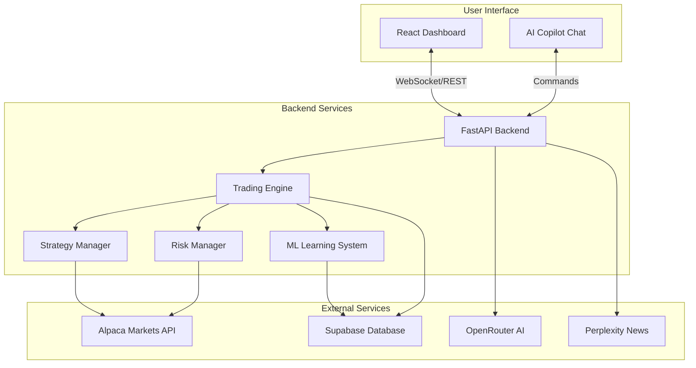
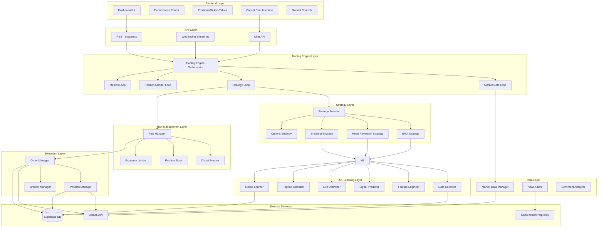
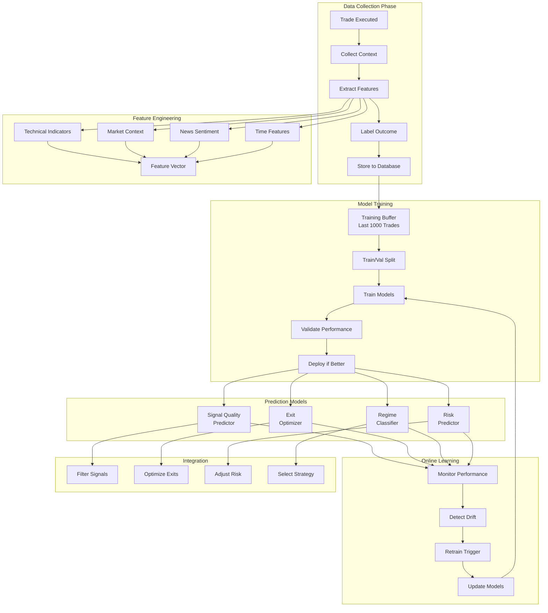
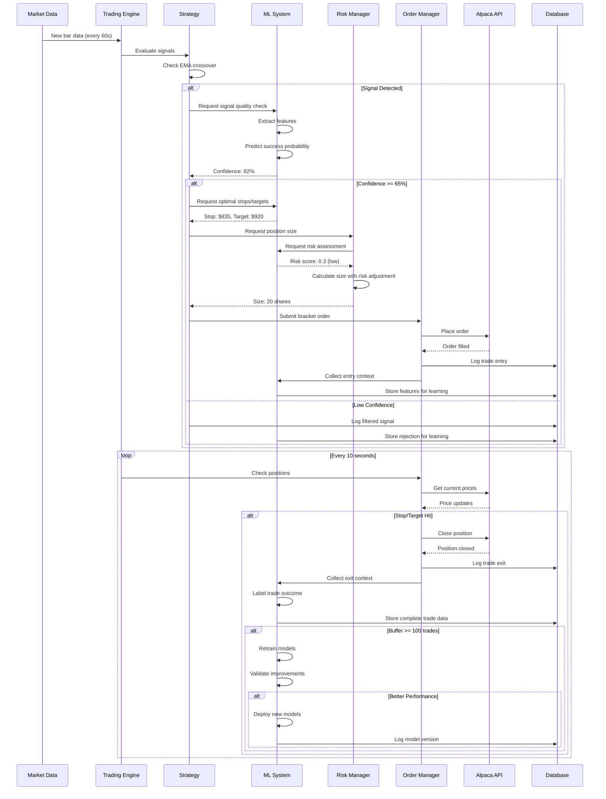
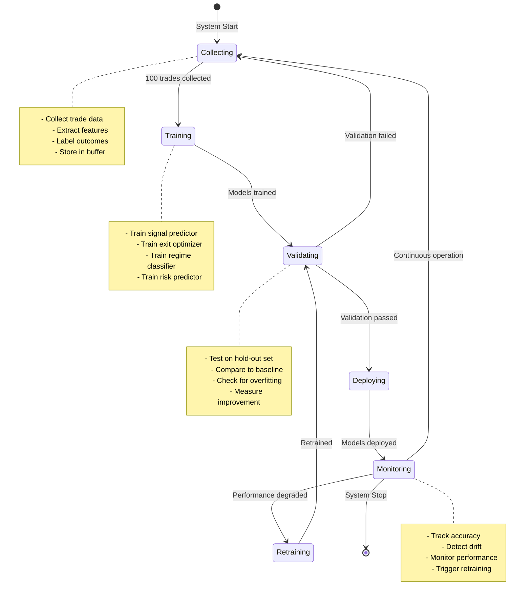
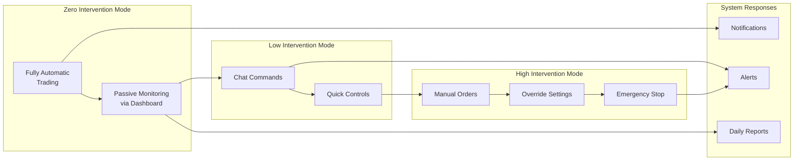

# DayTraderAI - System Architecture

## Vision
A fully autonomous AI-powered day trading system that learns and improves continuously with minimal user intervention. The system trades automatically, learns from every trade, and optimizes itself over time.

## Table of Contents
1. [System Overview](#system-overview)
2. [Architecture Diagrams](#architecture-diagrams)
3. [Component Details](#component-details)
4. [ML Learning System](#ml-learning-system)
5. [Data Flow](#data-flow)
6. [Deployment Architecture](#deployment-architecture)
7. [User Interaction Model](#user-interaction-model)

---

## System Overview

### High-Level Architecture



### Core Principles

1. **Autonomous Operation**: System runs 24/7 during market hours without intervention
2. **Continuous Learning**: ML models improve with every trade
3. **Risk-First Design**: Multiple safety layers prevent catastrophic losses
4. **Graceful Degradation**: System continues operating even if components fail
5. **User Control**: Simple chat interface for any manual intervention needed

---

## Architecture Diagrams

### 1. Complete System Architecture



### 2. ML Learning System Architecture



### 3. Trading Workflow with ML Integration



### 4. ML Learning Lifecycle



### 5. User Interaction Model



---

## Component Details

### Trading Engine

**Purpose**: Orchestrates all trading activities and coordinates between components

**Key Responsibilities**:
- Start/stop trading loops
- Coordinate market data, strategy, and position monitoring
- Handle WebSocket streaming
- Manage system lifecycle

**Loops**:
1. **Market Data Loop** (60s interval)
   - Fetch latest bars for watchlist
   - Update technical indicators
   - Update position prices

2. **Strategy Loop** (60s interval)
   - Evaluate signals for each symbol
   - Check ML confidence
   - Submit orders if criteria met

3. **Position Monitor Loop** (10s interval)
   - Check stop loss / take profit
   - Update trailing stops
   - Close positions when triggered

4. **Metrics Loop** (5min interval)
   - Calculate performance metrics
   - Store snapshots to database
   - Broadcast to UI

### ML Learning System

**Purpose**: Continuously learn from trades and improve decision-making

**Components**:

1. **Data Collector**
   - Captures every trade with full context
   - Extracts 50+ features
   - Labels outcomes (win/loss, profit%, etc.)
   - Stores in training buffer

2. **Feature Engineer**
   - Technical indicators (EMA, RSI, ATR, MACD, etc.)
   - Market context (SPY trend, VIX, sector momentum)
   - Sentiment (news, social media)
   - Temporal (time of day, day of week)
   - Position context (existing exposure, correlation)

3. **Signal Predictor**
   - Predicts probability of profitable trade
   - Filters low-quality signals
   - Threshold: 65% confidence minimum
   - Algorithm: Random Forest / XGBoost

4. **Exit Optimizer**
   - Predicts optimal stop loss and take profit
   - Adapts to volatility and trend strength
   - Maximizes risk-reward ratio
   - Algorithm: Reinforcement Learning (Q-Learning)

5. **Regime Classifier**
   - Classifies market regime (trending/ranging/volatile/calm)
   - Selects best strategy for current conditions
   - Updates every 5 minutes
   - Algorithm: K-Means / Neural Network

6. **Risk Predictor**
   - Predicts expected drawdown
   - Estimates win probability
   - Adjusts position size dynamically
   - Algorithm: Gradient Boosting

7. **Online Learner**
   - Retrains models every 100 trades
   - Validates on hold-out set
   - Deploys if performance improves
   - Tracks model versions

**Learning Phases**:

**Phase 1: Bootstrap (Trades 1-100)**
- Collect data with rule-based strategy
- No ML filtering (collect diverse examples)
- Build initial training set

**Phase 2: Initial Training (Trades 100-200)**
- Train first models
- Start filtering signals (conservative threshold: 70%)
- Validate improvements

**Phase 3: Active Learning (Trades 200-500)**
- Lower threshold to 65%
- Retrain every 100 trades
- Optimize parameters

**Phase 4: Continuous Improvement (Trades 500+)**
- Full ML integration
- Adaptive thresholds
- Strategy optimization
- Auto-parameter tuning

### Strategy Manager

**Purpose**: Generate trading signals and execute trades

**Strategies**:

1. **EMA Crossover** (Primary)
   - Entry: EMA(9) crosses EMA(21)
   - Exit: Stop loss or take profit
   - Best for: Trending markets

2. **Mean Reversion** (Secondary)
   - Entry: RSI < 30 (oversold) or RSI > 70 (overbought)
   - Exit: Return to mean or stop loss
   - Best for: Ranging markets

3. **Breakout** (Tertiary)
   - Entry: Price breaks above resistance with volume
   - Exit: Trailing stop or target
   - Best for: Volatile markets

4. **Options** (Advanced)
   - Covered calls on long positions
   - Protective puts for hedging
   - Best for: Income generation and risk management

**Strategy Selection**:
- ML Regime Classifier determines market condition
- Automatically switches to best strategy
- Can run multiple strategies simultaneously

### Risk Management

**Purpose**: Protect capital and prevent catastrophic losses

**Controls**:

1. **Position Sizing**
   - Base: 1% risk per trade
   - ML-adjusted: 0.5% - 2% based on confidence
   - Never exceed 5% per position

2. **Exposure Limits**
   - Max 20 positions simultaneously
   - Max 40% in single sector
   - Max 60% total capital deployed

3. **Circuit Breaker**
   - Triggers at -5% daily drawdown
   - Halts new trades
   - Existing positions remain (with stops)
   - Auto-resets next trading day

4. **Correlation Checks**
   - Avoid highly correlated positions (>0.7)
   - Diversify across sectors
   - Monitor portfolio beta

5. **Time-Based Rules**
   - No trades first 15 minutes (market open volatility)
   - No trades last 15 minutes (market close)
   - Reduce size during lunch hour (low volume)

### Order Management

**Purpose**: Execute trades reliably and efficiently

**Features**:

1. **Bracket Orders**
   - Entry + Stop Loss + Take Profit in one order
   - Automatic execution
   - Reduces slippage

2. **Trailing Stops**
   - Locks in profits as price moves favorably
   - ATR-based distance
   - Updates every 10 seconds

3. **Order Validation**
   - Check buying power
   - Verify risk limits
   - Confirm ML approval
   - Log all decisions

4. **Execution Tracking**
   - Monitor fill status
   - Handle partial fills
   - Retry on failures
   - Alert on issues

---

## ML Learning System

### Data Collection

**Trade Data Structure**:
```python
{
    # Identifiers
    "trade_id": "uuid",
    "symbol": "AAPL",
    "strategy": "ema_crossover",
    
    # Entry Context (50+ features)
    "entry_time": "2025-01-15T10:30:00Z",
    "entry_price": 175.50,
    "ema_9": 174.20,
    "ema_21": 173.80,
    "ema_50": 172.50,
    "rsi_14": 65.5,
    "atr_14": 2.50,
    "macd": 0.85,
    "macd_signal": 0.65,
    "volume": 1250000,
    "volume_sma_20": 850000,
    "volume_ratio": 1.47,
    
    # Market Context
    "spy_price": 485.20,
    "spy_ema_9": 483.50,
    "spy_trend": "bullish",
    "vix_level": 15.2,
    "vix_trend": "falling",
    "sector": "technology",
    "sector_momentum": 0.65,
    
    # Sentiment
    "news_count_24h": 3,
    "news_sentiment": 0.7,  # -1 to 1
    "social_sentiment": 0.5,
    
    # Temporal
    "time_of_day": "morning",  # morning/midday/afternoon
    "day_of_week": "Tuesday",
    "days_to_earnings": 45,
    
    # Position Context
    "existing_positions": 8,
    "portfolio_exposure": 0.45,
    "sector_exposure": 0.15,
    "correlated_positions": 2,
    
    # Exit Context
    "exit_time": "2025-01-15T14:45:00Z",
    "exit_price": 178.20,
    "exit_reason": "take_profit",
    "hold_time_minutes": 255,
    "max_favorable_excursion": 3.2,
    "max_adverse_excursion": -0.8,
    
    # Outcome
    "profit_loss": 2.70,
    "profit_loss_pct": 1.54,
    "win": true,
    "risk_reward_ratio": 2.7,
    "sharpe_contribution": 0.15,
    
    # ML Metadata
    "ml_confidence": 0.82,
    "ml_predicted_win_prob": 0.78,
    "ml_predicted_profit": 2.5,
    "ml_model_version": "v1.2.3"
}
```

### Model Training Pipeline

**Step 1: Data Preparation**
```python
# Every 100 trades
1. Load last 1000 trades from database
2. Split: 70% train, 15% validation, 15% test
3. Balance classes (equal wins/losses)
4. Normalize features
5. Handle missing values
```

**Step 2: Feature Selection**
```python
# Identify most important features
1. Calculate feature importance
2. Remove low-importance features (<0.01)
3. Remove highly correlated features (>0.95)
4. Keep top 30-40 features
```

**Step 3: Model Training**
```python
# Train multiple models
1. Signal Predictor (Random Forest)
   - Input: 40 features
   - Output: Win probability (0-1)
   - Metric: ROC-AUC score
   
2. Exit Optimizer (XGBoost)
   - Input: 40 features + current position
   - Output: Optimal stop/target prices
   - Metric: Profit factor improvement
   
3. Regime Classifier (Neural Network)
   - Input: Market indicators
   - Output: Regime (4 classes)
   - Metric: Classification accuracy
   
4. Risk Predictor (Gradient Boosting)
   - Input: 40 features
   - Output: Expected max drawdown
   - Metric: Mean absolute error
```

**Step 4: Validation**
```python
# Test on hold-out set
1. Calculate metrics on validation set
2. Compare to baseline (rule-based)
3. Check for overfitting (train vs val gap)
4. Require minimum improvement (5%)
```

**Step 5: Deployment**
```python
# Deploy if better
1. Save model to disk
2. Version with timestamp
3. Update model registry
4. Gradual rollout (A/B test 20% of trades)
5. Monitor live performance
6. Full rollout if successful
```

### Continuous Learning Loop

```python
# Runs continuously
while trading:
    # Collect data
    trade = execute_trade()
    features = extract_features(trade)
    outcome = label_outcome(trade)
    store_to_buffer(features, outcome)
    
    # Check if time to retrain
    if buffer.size >= 100:
        # Train new models
        new_models = train_models(buffer)
        
        # Validate
        if validate(new_models) > current_performance:
            # Deploy
            deploy_models(new_models)
            log_model_update()
        
        # Clear old data
        buffer.keep_last(1000)
```

### Performance Tracking

**Metrics Monitored**:
- Model accuracy (win rate prediction)
- Calibration (predicted vs actual probabilities)
- Feature drift (distribution changes)
- Prediction latency
- Model version performance

**Alerts**:
- Accuracy drops below 60%
- Calibration error > 10%
- Feature drift detected
- Latency > 100ms
- Model rollback triggered

---

## Data Flow

### Real-Time Trading Flow

```
Market Opens
    ↓
Market Data Loop Starts (every 60s)
    ↓
Fetch latest bars for watchlist
    ↓
Update technical indicators
    ↓
Strategy Loop Evaluates (every 60s)
    ↓
For each symbol:
    ↓
    Check traditional signal (EMA crossover)
    ↓
    If signal detected:
        ↓
        ML Signal Predictor checks quality
        ↓
        If confidence >= 65%:
            ↓
            ML Exit Optimizer suggests stops/targets
            ↓
            ML Risk Predictor assesses risk
            ↓
            Risk Manager calculates position size
            ↓
            Order Manager submits bracket order
            ↓
            Data Collector captures entry context
            ↓
            Store to database
    ↓
Position Monitor Loop (every 10s)
    ↓
    Check all open positions
    ↓
    Update trailing stops
    ↓
    If stop/target hit:
        ↓
        Close position
        ↓
        Data Collector captures exit context
        ↓
        Label trade outcome
        ↓
        Store complete trade data
        ↓
        If buffer >= 100 trades:
            ↓
            Trigger model retraining
            ↓
            Validate new models
            ↓
            Deploy if better
```

### ML Learning Flow

```
Trade Completed
    ↓
Extract Features (50+)
    ├── Technical Indicators
    ├── Market Context
    ├── Sentiment Data
    ├── Temporal Features
    └── Position Context
    ↓
Label Outcome
    ├── Win/Loss
    ├── Profit/Loss %
    ├── Hold Time
    ├── Exit Reason
    └── Risk-Reward Ratio
    ↓
Store to Training Buffer
    ↓
Buffer Size Check
    ↓
If >= 100 trades:
    ↓
    Load Training Data (last 1000 trades)
    ↓
    Split Train/Val/Test
    ↓
    Train Models
        ├── Signal Predictor
        ├── Exit Optimizer
        ├── Regime Classifier
        └── Risk Predictor
    ↓
    Validate on Hold-Out Set
    ↓
    Compare to Baseline
    ↓
    If Improvement >= 5%:
        ↓
        Deploy New Models
        ↓
        A/B Test (20% traffic)
        ↓
        Monitor Performance
        ↓
        If Successful:
            ↓
            Full Rollout (100% traffic)
            ↓
            Log Model Version
        Else:
            ↓
            Rollback to Previous Version
    Else:
        ↓
        Keep Current Models
        ↓
        Log Training Attempt
```

---

## Deployment Architecture

### Development Environment
```
Local Machine
├── Frontend (React + Vite)
│   └── Port 5173
├── Backend (FastAPI)
│   └── Port 8000
└── Database (Supabase Cloud)
```

### Production Environment
```
Cloud Server (AWS/GCP/DigitalOcean)
├── Frontend (Nginx)
│   └── Port 443 (HTTPS)
├── Backend (Gunicorn + FastAPI)
│   └── Port 8000 (internal)
├── Database (Supabase Cloud)
├── ML Models (Local Storage)
└── Monitoring (Prometheus + Grafana)
```

### Systemd Service (Auto-Restart)
```bash
# /etc/systemd/system/daytrader.service
[Unit]
Description=DayTraderAI Trading Bot
After=network.target

[Service]
Type=simple
User=trader
WorkingDirectory=/home/trader/DayTraderAI
ExecStart=/home/trader/DayTraderAI/start_app.sh
Restart=always
RestartSec=10

[Install]
WantedBy=multi-user.target
```

---

## User Interaction Model

### Interaction Levels

**Level 0: Zero Intervention (Default)**
- System runs fully automatically
- User only monitors dashboard
- Receives daily summary reports
- No action required

**Level 1: Passive Monitoring**
- User checks dashboard occasionally
- Reviews trade analysis
- Reads AI reasoning
- No intervention needed

**Level 2: Chat Commands**
- User asks questions: "What's the market doing?"
- User requests status: "Show me open positions"
- User gets explanations: "Why did you close AAPL?"
- Simple natural language

**Level 3: Quick Controls**
- User closes specific position: "close NVDA"
- User cancels order: "cancel order abc123"
- User adjusts settings: "reduce risk to 0.5%"
- One-line commands

**Level 4: Manual Override**
- User places manual order: "buy 50 AAPL"
- User disables strategy: "disable mean reversion"
- User adjusts watchlist: "add TSLA to watchlist"
- Direct control

**Level 5: Emergency Stop**
- User hits emergency stop button
- System closes all positions
- Trading halted
- Requires explicit re-enable

### Chat Commands

**Status & Information**:
- `status` - Overall system status
- `positions` - Show open positions
- `orders` - Show pending orders
- `performance` - Show today's performance
- `help` - List available commands

**Trading Actions**:
- `close all` - Close all positions
- `close AAPL` - Close specific position
- `cancel order <id>` - Cancel order
- `buy 50 NVDA` - Manual buy order
- `sell 25 MSFT` - Manual sell order

**Configuration**:
- `set risk 0.5%` - Adjust risk per trade
- `set max positions 15` - Adjust max positions
- `add TSLA` - Add to watchlist
- `remove QQQ` - Remove from watchlist
- `enable trading` - Enable trading
- `disable trading` - Disable trading

**Analysis**:
- `why did you buy AAPL?` - Explain trade reasoning
- `what's the market sentiment?` - Market analysis
- `show me NVDA analysis` - Symbol-specific analysis
- `what's the ML confidence?` - ML model status

---

## Summary

This architecture provides:

1. **Full Autonomy**: System trades automatically without intervention
2. **Continuous Learning**: ML improves with every trade
3. **Multiple Safety Layers**: Risk management, circuit breakers, position limits
4. **Simple Control**: Chat interface for any needed intervention
5. **Graceful Degradation**: System continues even if components fail
6. **Scalability**: Can add more strategies, symbols, and features
7. **Transparency**: Full logging and reasoning for every decision

The system starts with rule-based trading, collects data, trains ML models, and gradually becomes more intelligent over time. After 300+ trades, the ML system significantly improves performance while maintaining safety.
