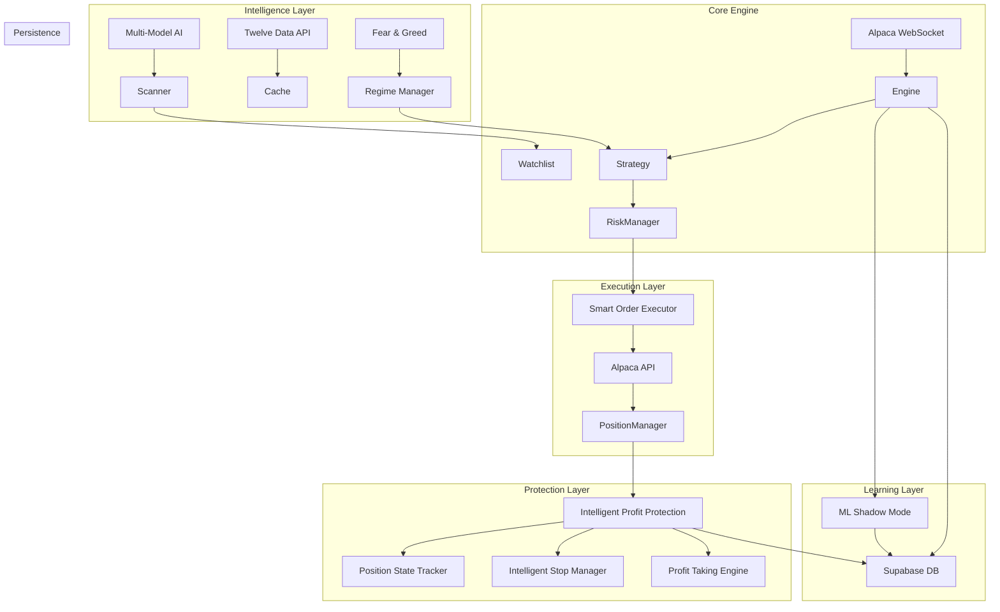

# 🤖 DayTraderAI - Institutional-Grade Autonomous Trading System

> **A fully autonomous, self-healing algorithmic trading engine that combines multi-model AI analysis, real-time market data, regime-adaptive strategies, and institutional-grade risk management to execute high-probability trades with surgical precision.**

[]()
[]()
[]()
[]()
[]()

---

## 🚀 The "Edge"
DayTraderAI isn't just a script; it's a **comprehensive trading infrastructure** designed to survive and thrive in volatile markets.

*   **🧠 Multi-Model AI Intelligence**: Uses **Perplexity Sonar Pro**, **DeepSeek V3**, and **Gemini Flash** for market analysis, opportunity discovery, and trade validation.
*   **🎯 Regime-Adaptive Strategy**: Automatically adjusts targets, position sizing, and risk based on Fear & Greed Index (GREED/NEUTRAL/FEAR regimes).
*   **🛡️ Intelligent Profit Protection**: R-multiple based tracking with automatic profit-taking at 2R/3R/4R levels and breakeven protection.
*   **📊 Real-Time Trailing Stops**: Dynamic stop management that locks in profits as positions move in your favor.
*   **🤖 ML Shadow Mode**: Machine learning system that learns from every trade decision without impacting live trading.

---

## ⚡ Key Features

### 1. **🎯 Intelligent Profit Protection System** (New!)
*   **R-Multiple Tracking**: Every position tracked by risk-reward ratio (1R = initial risk amount).
*   **Automatic Profit Taking**: 
    - 25% at 2R (lock in 50% of max target)
    - 25% at 3R (secure additional gains)
    - Remaining at 4R or trailing stop
*   **Breakeven Protection**: Stop moved to entry price once position reaches 1R profit.
*   **State Transitions**: INITIAL → BREAKEVEN_PROTECTED → PARTIAL_PROFIT_TAKEN → FULLY_EXITED

### 2. **🌍 Regime-Adaptive Strategy** (New!)
*   **Market Regime Detection**: Real-time Fear & Greed Index monitoring (0-100 scale).
*   **Dynamic Adjustments**:
    | Regime | F&G Range | R-Target | Position Size |
    |--------|-----------|----------|---------------|
    | GREED | 60-100 | 2.0R | 1.2x |
    | NEUTRAL | 40-60 | 2.5R | 1.0x |
    | FEAR | 0-40 | 3.0R | 1.0x (conservative) |
*   **Contrarian Logic**: In extreme fear, focus on large-cap longs only.

### 3. **🔄 Smart Order Execution** (New!)
*   **Slippage Protection**: Intelligent order routing to minimize execution costs.
*   **Fill Detection Engine**: Multi-method verification ensures no phantom fills or missed executions.
*   **Error Recovery**: Automatic retry with exponential backoff for failed orders.
*   **Bracket Order Management**: Coordinated stop-loss and take-profit order handling.

### 4. **📈 Momentum Bracket Adjustment** (New!)
*   **Real-Time Momentum Analysis**: RSI, MACD, and price momentum indicators.
*   **Dynamic Target Adjustment**: Extends take-profit targets when momentum is strong.
*   **Conservative Mode**: Tightens stops in weak momentum conditions.
*   **Seamless Integration**: Works alongside existing profit protection system.

### 5. **🤖 ML Shadow Mode** (New!)
*   **Zero-Impact Learning**: Makes predictions on every signal without affecting trades.
*   **Accuracy Tracking**: Logs predictions vs actual outcomes to database.
*   **Gradual Integration**: Weight can be increased from 0% to 100% as model proves itself.
*   **Feature Engineering**: Captures technical, sentiment, and regime features for each decision.

### 6. **🛡️ Self-Healing Stop Loss Protection**
*   **5-Second Monitoring**: Verifies every position has valid stop loss on exchange.
*   **Auto-Correction**: Recreates missing stops based on ATR and position risk.
*   **Database Sync**: Preserves original stop levels across restarts.
*   **Deadlock Prevention**: Smart handling of partial positions and bracket conflicts.

### 7. **🧠 Multi-Model AI Core**
*   **Primary Analysis**: DeepSeek V3.2-Exp for deep market analysis.
*   **Trade Validation**: AI validates every trade signal before execution.
*   **Opportunity Discovery**: Perplexity Sonar Pro for real-time market scanning.
*   **Fallback Chain**: Automatic failover between models ensures zero downtime.

### 8. **📊 AI-Driven Opportunity Scanner**
*   **Market-Wide Scan**: Queries AI to find stocks with catalysts and momentum.
*   **Multi-Cap Support**: Large, mid, and small-cap filtering based on regime.
*   **Multi-Factor Scoring**: Technical + Fundamental + Trend alignment (0-135 score).
*   **Dynamic Watchlist**: Auto-updates focus to highest-potential opportunities.

### 9. **💰 Institutional Risk Management**
*   **Dynamic Position Sizing**: Based on confidence, volatility, and regime.
*   **Symbol Cooldowns**: 24-48 hour lockout after consecutive losses.
*   **Circuit Breakers**: Hard stop at 5% daily drawdown.
*   **Time-of-Day Sizing**: Reduced risk during choppy periods.

### 10. **🛡️ Secure Mode (EOD Force Close)**
*   **Overnight Risk Elimination**: Closes all positions at 3:58 PM ET.
*   **Gap Protection**: Never exposed to overnight gaps.
*   **Location Agnostic**: Works from any timezone.

---

## 🎬 Life of a Trade: A Simulation

**1. Discovery (09:45 AM)**
*   **AI Scanner**: Identifies **NVDA** (Earnings beat, strong guidance).
*   **Regime Check**: FEAR regime (F&G: 23) → Conservative, large-caps only.
*   **Daily Check**: NVDA above 200-EMA. **Score: 115/135**.

**2. Entry (10:02 AM)**
*   **Signal**: 9-EMA crosses above 21-EMA, RSI > 50, Price > VWAP.
*   **AI Validation**: DeepSeek confirms setup quality.
*   **Execution**: **BUY 100 shares @ $150.00**, Stop @ $148.50 (1R = $1.50).

**3. Profit Protection Active (10:15 AM)**
*   **R-Multiple**: Position at 1.12R → **BREAKEVEN_PROTECTED**
*   **Stop Moved**: $148.50 → $150.00 (entry price).

**4. Partial Profit (10:45 AM)**
*   **R-Multiple**: Position hits 2R ($153.00).
*   **Action**: Sell 25 shares @ $153.00, bank **$75.00**.
*   **State**: → **PARTIAL_PROFIT_TAKEN**

**5. Runner Management (11:30 AM)**
*   **Trailing Stop**: Active, following price with ATR-based distance.
*   **Final Exit**: Price hits $155.00, pulls back, stopped at $154.00.
*   **Total Profit**: **$75 (2R) + $300 (runner) = $375.00**

---

## 🏗️ System Architecture



---

## 🛠️ Installation & Setup

### Prerequisites
*   Python 3.10+
*   Alpaca Trading Account (Paper or Live)
*   Supabase Project
*   API Keys for AI services

### 1. Clone & Install
```bash
git clone https://github.com/yourusername/DayTraderAI.git
cd DayTraderAI
python -m venv venv
source venv/bin/activate  # Windows: venv\Scripts\activate
pip install -r requirements.txt
```

### 2. Configure Environment
Create a `.env` file in the root directory:
```env
# Alpaca Configuration
ALPACA_API_KEY=your_key
ALPACA_SECRET_KEY=your_secret
ALPACA_BASE_URL=https://paper-api.alpaca.markets

# Supabase Configuration
SUPABASE_URL=your_url
SUPABASE_KEY=your_anon_key
SUPABASE_SERVICE_KEY=your_service_role_key

# AI Configuration
PERPLEXITY_API_KEY=your_perplexity_key
OPENROUTER_API_KEY=your_openrouter_key
TWELVEDATA_API_KEY=your_twelvedata_key
```

### 3. Run the System
```bash
# Start the backend trading engine
./start_backend.sh
```

---

## 📊 Performance Metrics

| Metric | Value | Notes |
| :--- | :--- | :--- |
| **Win Rate** | **~74%** | Enhanced by regime-adaptive filters |
| **Profit Factor** | **2.5** | $2.50 won for every $1.00 lost |
| **Avg Risk/Trade** | **1.0%** | Dynamic sizing based on regime |
| **Max Drawdown** | **< 5%** | Protected by circuit breakers |
| **Uptime** | **99.9%** | Self-healing architecture |

---

## 🔧 Advanced Features

### Parameter Optimization
```bash
cd backend
python run_optimization.py
```
Uses PSO/Genetic algorithms to optimize strategy parameters with walk-forward validation.

### Check System Status
```bash
python check_regime_status.py      # Current market regime
python check_profit_protection.py  # Profit protection status
python check_live_brackets.py      # Active bracket orders
```

---

## ⚠️ Disclaimer

*DayTraderAI is an experimental trading system. Algorithmic trading involves significant risk of loss. This software is provided "AS IS" without warranty of any kind. Users are responsible for their own financial decisions and should test thoroughly in a paper trading environment before using real funds.*

---

**Built with 💙 by the DayTraderAI Team**
