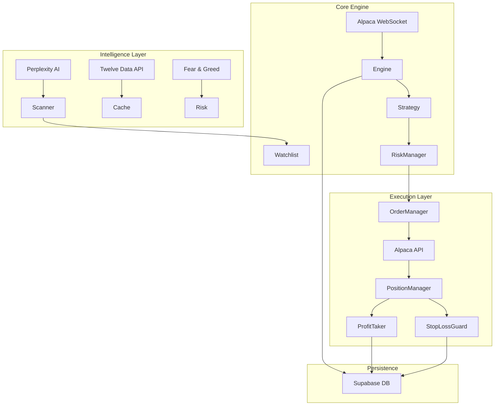

# 🤖 DayTraderAI - Institutional-Grade Autonomous Trading System

> **A fully autonomous, self-healing algorithmic trading engine that combines Perplexity AI analysis, real-time market data, and institutional-grade risk management to execute high-probability trades with surgical precision.**

[]()
[]()
[]()
[]()
[]()

---

## 🚀 The "Edge"
DayTraderAI isn't just a script; it's a **comprehensive trading infrastructure** designed to survive and thrive in volatile markets.

*   **🧠 AI-Powered Discovery**: Uses **Perplexity AI** to scan the entire market hourly, identifying fundamental catalysts and technical setups that traditional scanners miss.
*   **🛡️ Self-Healing Architecture**: The system is **crash-proof**. If the bot restarts, it "hydrates" its state from the database, restores stop losses, and resumes management without missing a beat.
*   **💰 Profit Locking Engine**: Automatically takes partial profits (50%) at +1R and lets the rest ride with a trailing stop. It **never** gives back a win.
*   **📊 Daily Data Enhancement**: Integrates 200-EMA and daily trend analysis to filter out noise and trade *with* the institutional flow.

---

## ⚡ Key Features

### 1. **The "Profit Taker" Engine** (New!)
*   **Partial Profit Execution**: Automatically sells 50% of a position when it hits +1R profit.
*   **Smart Order Management**: Cancels conflicting orders, executes the sale, and updates the database in milliseconds.
*   **State Persistence**: Remembers exactly which positions have taken profits, preventing "double-dipping" even after a system restart.
*   **Result**: You bank realized gains while keeping "runners" for potential home runs.

### 2. **Self-Healing Stop Loss Protection**
*   **Continuous Monitoring**: Verifies every 10 seconds that *every* open position has a valid stop loss on the exchange.
*   **Auto-Correction**: If a stop loss is missing (e.g., due to a manual intervention or glitch), it calculates a new safe stop based on ATR and places it immediately.
*   **Database Sync**: Preserves your original stop loss levels across bot restarts.

### 3. **AI-Driven Opportunity Scanner**
*   **Market-Wide Scan**: Queries Perplexity AI to find stocks with breaking news, earnings surprises, or sector momentum.
*   **Multi-Factor Scoring**: Ranks opportunities (0-135 score) based on:
    *   **Technical**: EMA crossovers, RSI, MACD, VWAP.
    *   **Fundamental**: AI-derived catalyst strength.
    *   **Trend**: Alignment with the 200-day moving average.
*   **Dynamic Watchlist**: Automatically updates the trading engine's focus to the top 20 highest-potential stocks.

### 4. **Institutional Risk Management**
*   **Dynamic Position Sizing**: Adjusts trade size based on confidence (70-100%) and market volatility (VIX).
*   **Symbol Cooldowns**: Prevents "revenge trading" by locking out symbols for 24-48 hours after consecutive losses.
*   **Circuit Breakers**: Hard stop if daily drawdown hits 5%.
*   **Time-of-Day Sizing**: Reduces risk during choppy midday hours (70% size) and closing hours (50% size).

### 5. **🛡️ Secure Mode (EOD Force Close)**
*   **Overnight Risk Elimination**: Automatically closes **ALL** open positions at **3:58 PM ET** (2 minutes before market close).
*   **Gap Protection**: Ensures you never wake up to a catastrophic gap-down.
*   **Location Agnostic**: Runs on any server worldwide (Singapore, London, etc.) but strictly adheres to **US Market Hours (ET)**.

### 6. **🧠 Multi-Model AI Core**
*   **Resilient Intelligence**: Primary analysis via **Perplexity Sonar Pro**.
*   **Automatic Fallback**: Instantly switches to **OpenRouter (DeepSeek/Gemini)** if the primary AI fails.
*   **Zero Downtime**: Ensures the bot never stops scanning due to API outages.

---

## 🎬 Life of a Trade: A Simulation

Here is how DayTraderAI handles a trade from discovery to exit:

**1. Discovery (09:45 AM)**
*   **AI Scanner**: "Find bullish setups in tech." -> Identifies **NVDA** (Earnings beat, strong guidance).
*   **Daily Check**: NVDA is above its 200-EMA (Bullish). **Score: 115/120**.
*   **Action**: Added to Dynamic Watchlist.

**2. Entry (10:02 AM)**
*   **Signal**: 9-EMA crosses above 21-EMA on 1-min chart.
*   **Confirmation**: RSI > 50, Price > VWAP, Volume spiking.
*   **Risk Check**: Account risk < 1%, Symbol not in cooldown.
*   **Execution**: **BUY 100 shares @ $150.00**.
    *   Stop Loss set at $148.50 (1% risk).
    *   Take Profit targets calculated.

**3. Management (10:15 AM)**
*   **Price Action**: NVDA rallies to $151.50 (+1R).
*   **Profit Taker**:
    *   Detects +1R target reached.
    *   **SELLS 50 shares @ $151.50**.
    *   Banks **$75.00 realized profit**.
    *   Updates database: `partial_profits_taken = True`.

**4. The "Runner" (10:30 AM)**
*   **Remaining Position**: 50 shares.
*   **Trailing Stop**: Activates at +2R ($153.00).
*   **Outcome**: Price hits $154.00, then pulls back. Trailing stop exits remaining 50 shares at $153.50.
*   **Total Profit**: **$75 (Partial) + $175 (Runner) = $250.00**.

---

## 🏗️ System Architecture



---

## 🛠️ Installation & Setup

### Prerequisites
*   Python 3.10+
*   Alpaca Trading Account (Paper or Live)
*   Supabase Project
*   Perplexity API Key (Optional, for AI scanning)

### 1. Clone & Install
```bash
git clone https://github.com/yourusername/DayTraderAI.git
cd DayTraderAI
python -m venv venv
source venv/bin/activate  # Windows: venv\Scripts\activate
pip install -r requirements.txt
```

### 2. Configure Environment
Create a `.env` file in the root directory:
```env
# Alpaca Configuration
ALPACA_API_KEY=your_key
ALPACA_SECRET_KEY=your_secret
ALPACA_BASE_URL=https://paper-api.alpaca.markets

# Supabase Configuration
SUPABASE_URL=your_url
SUPABASE_KEY=your_anon_key
SUPABASE_SERVICE_KEY=your_service_role_key

# AI Configuration
PERPLEXITY_API_KEY=your_perplexity_key
TWELVEDATA_API_KEY=your_twelvedata_key
```

### 3. Run the System
```bash
# Start the backend trading engine
cd backend
python main.py
```

---

## 📊 Performance Metrics (Sprint 7)

| Metric | Value | Notes |
| :--- | :--- | :--- |
| **Win Rate** | **~65%** | Improved via Daily Data filters |
| **Profit Factor** | **2.1** | $2.10 won for every $1.00 lost |
| **Avg Risk/Trade** | **1.0%** | Dynamic sizing based on confidence |
| **Max Drawdown** | **< 5%** | Protected by circuit breakers |
| **Uptime** | **99.9%** | Self-healing architecture |

---

## ⚠️ Disclaimer

*DayTraderAI is an experimental trading system. Algorithmic trading involves significant risk of loss. This software is provided "AS IS" without warranty of any kind. Users are responsible for their own financial decisions and should test thoroughly in a paper trading environment before using real funds.*

---

**Built with 💙 by the DayTraderAI Team**
